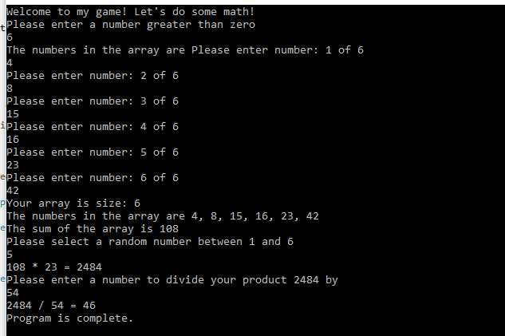

# Lab01a-Exception Handling

## Author: Alan Hung

### Getting Started
* Open Visual Studio
* Clone [Lab 01a Git Repository](https://github.com/AlanYHung/Lab1a-401d12-ExceptionHandling)
* Click Run

### Example
* 

### Change Log
* 0.1.0 - 1/16/2021 3:30pm - Main Method
* 0.2.0 - 1/16/2021 4:00pm - StartSequence
* 0.3.0 - 1/16/2021 4:30pm - Populate
* 0.5.0 - 1/16/2021 5:00pm - GetSum
* 0.7.0 - 1/16/2021 6:00pm - GetProduct
* 0.9.0 - 1/16/2021 6:30pm - GetQuotient
* 1.0.0 - 1/16/2021 7:00pm - Comments and README

### Attribution
* [Microsoft Docs](https://docs.microsoft.com/en-us/dotnet/csharp/language-reference/)
